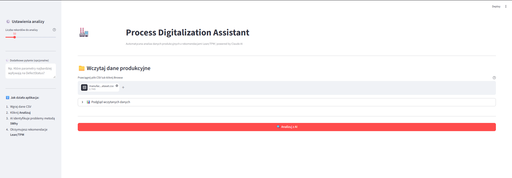
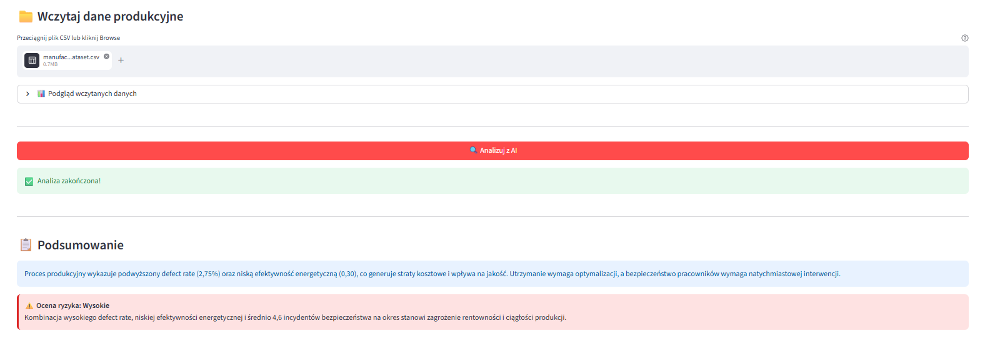
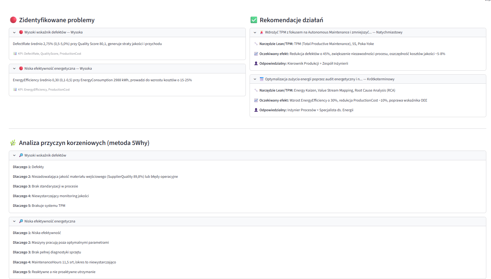
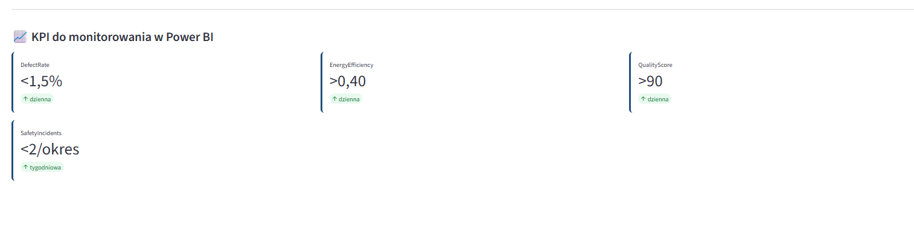

# 🏭 Process Digitalization Assistant

> Automatyczna analiza danych produkcyjnych z rekomendacjami Lean/TPM | powered by Claude AI

## 🎯 O projekcie

Aplikacja webowa zbudowana w Streamlit, która analizuje dane produkcyjne przy użyciu modelu językowego (Claude AI) i generuje strukturalny raport zawierający:

- **Identyfikację problemów** jakościowych i operacyjnych z wagą (Wysoka/Średnia/Niska)
- **Analizę przyczyn korzeniowych** metodą 5Why
- **Rekomendacje działań** z przypisaniem narzędzi Lean/TPM (SPC, TPM, Kaizen, Poka-Yoke)
- **KPI do monitorowania** z celami i częstotliwością pomiaru
- **Ocenę ryzyka** operacyjnego (Wysokie/Średnie/Niskie)

## 📸 Zrzuty ekranu

### Wczytanie danych i analiza


### Podsumowanie i ocena ryzyka


### Zidentyfikowane problemy i rekomendacje


### KPI do monitorowania w Power BI


## 🛠️ Technologie

| Technologia | Zastosowanie |
|---|---|
| Python | Backend, przetwarzanie danych |
| Streamlit | Interfejs użytkownika (web app) |
| Claude AI (Anthropic) | Analiza danych i generowanie insightów |
| pandas | Wczytywanie i transformacja danych CSV |
| Prompt Engineering | Strukturyzacja odpowiedzi AI w formacie JSON |

## 📊 Przykładowy dataset

Aplikacja testowana na datasecie produkcyjnym z Kaggle:  
[Manufacturing Defects Dataset](https://www.kaggle.com/datasets/rabieelkharoua/predicting-manufacturing-defects-dataset)  
3 240 rekordów | 17 kolumn | dane jakościowe i operacyjne

## 🚀 Uruchomienie lokalne

### 1. Sklonuj repozytorium
```bash
git clone https://github.com/izabela12074/digitalization_assistant.git
cd digitalization_assistant
```

### 2. Zainstaluj zależności
```bash
pip install -r requirements.txt
```

### 3. Dodaj klucz API
Utwórz plik `.env` w folderze projektu:
```
ANTHROPIC_API_KEY=sk-ant-twój-klucz
```
Klucz API uzyskasz na: [console.anthropic.com](https://console.anthropic.com)

### 4. Uruchom aplikację
```bash
streamlit run app.py
```
Aplikacja otworzy się pod adresem: `http://localhost:8501`

## 💡 Jak używać

1. Wgraj plik CSV z danymi produkcyjnymi (dowolny format – aplikacja automatycznie wykrywa kolumny)
2. Opcjonalnie wpisz dodatkowe pytanie analityczne w sidebarze
3. Kliknij **Analizuj z AI**
4. Przejrzyj raport: problemy → przyczyny → rekomendacje → KPI

## 🏭 Kontekst biznesowy

Projekt stworzony jako narzędzie wspierające **digitalizację procesów produkcyjnych** zgodnie z metodologią:
- **Lean Manufacturing** – eliminacja marnotrawstwa
- **TPM** (Total Productive Maintenance) – niezawodność maszyn
- **Industry 4.0** – integracja AI w procesach fabrycznych

Efekt: skrócenie czasu analizy raportów produkcyjnych o ~60% vs. analiza manualna.

## 👩‍💻 Autor

**Izabela Popiołek** – Specjalista ds. Digitalizacji | Power BI Developer | AI Analyst  
[LinkedIn](www.linkedin.com/in/izabela-popiolek) | [GitHub](https://github.com/izabela12074)
